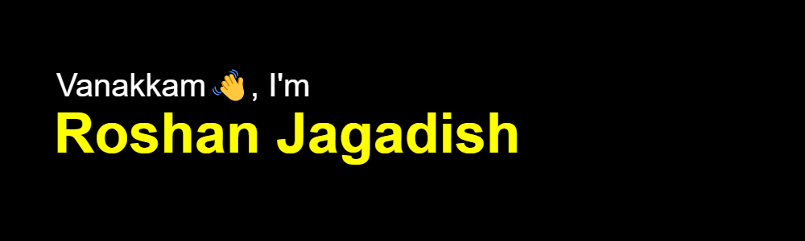

<!-- ## Hey 👋, I'm Roshan Jagadish!   -->
  

### Socials 🌏  

  
  
  

### Glad to see you here!  
I'm a full stack developer, app developer, AR/VR developer. Building new stuff is always a goal for me.

  
  

   

## Rapidfire 🔥
<table style="border:none;"><tr style="border:none;"><td style="border:none;" valign="top" width="70%">

- ### 🔭 I’m currently working on [finanxe](https://github.com/Wr4th100/finanxe)  
  

- ### 🌱 I’m currently learning Plaid and T3 Stack  
  

- ### ❓ Ask me about anything related to MERN stack and related technologies  
  

- ### ⚡ Fun fact: I am a functioning member in society  

- ### 📱 Developing my skills in React Native
 

- ### 🎮 Games are lub 

</td><td style="border:none;" valign="top" width="30%" >

  

</td></tr></table>  

   

## Languages and Tools 💻

  
  
  
  
  
  
  
  
  
  
  
  
  
  
  
  
  
  
  
  
  
  
  
  
  
  
  
 
  
  

  

   

## Github Stats 📈
<table style="border:none;overflow-y:hidden;"><tr><td valign="top" width="58%">

</td><td valign="top" width="42%">

</td></tr></table>  

   

## Github Contributions 😎
<picture>
  <source media="(prefers-color-scheme: dark)" srcset="https://raw.githubusercontent.com/Wr4th100/Wr4th100/output/github-contribution-grid-snake-dark.svg">
  <source media="(prefers-color-scheme: light)" srcset="https://raw.githubusercontent.com/Wr4th100/Wr4th100/output/github-contribution-grid-snake.svg">
  
</picture>

   

----
